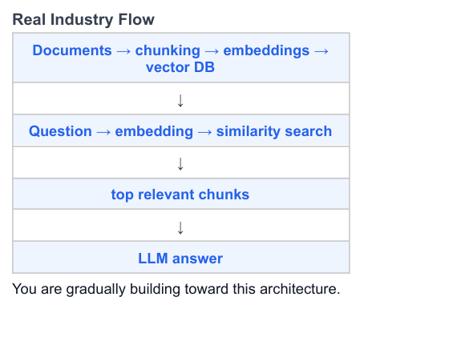

fixed sized chunking: 500 characters each. This is called: fixed-size chunking. Simple… but not 
smart. 

semantic chunking spliting on the basis of paragraph, sentences, meaning

RAG is mainly about: retrieval optimization. NOT "making AI smarter". It improves: relevance, 
scalability, cost, speed. That's why companies use it.

PDF
 ↓
pdf-parse
 ↓
chunks
 ↓
Gemini Embedding
 ↓
Qdrant
 ↓
similarity search
 ↓
Gemini LLM